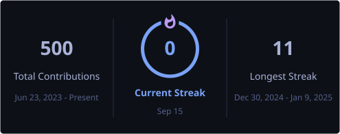

# 👋 Hi!

Frontend Developer. Passionate about web development, building modern interfaces, and exploring systems programming, computer graphics, and WebAssembly.

---

### 🛠 Tech Stack

#### Frontend & UI

#### Frameworks and State Management

#### Backend, Tools & New Horizons

---

  <picture>
    <source
      media="(prefers-color-scheme: dark)"
      srcset="./profile/github-snake-dark.svg"
    />
    <source
      media="(prefers-color-scheme: light)"
      srcset="./profile/github-snake.svg"
    />
    
  </picture>

  
  

  

